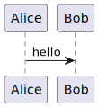
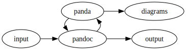
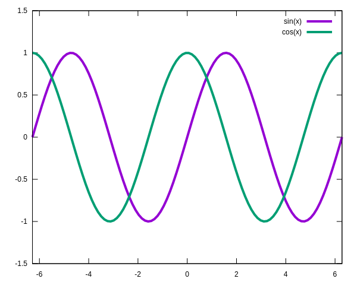
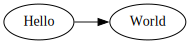

# About panda

Panda is a [Pandoc Lua filter](http://pandoc.org/lua-filters.html) that
works on internal Pandoc’s AST.

It provides several interesting features:

- variable expansion (minimalistic templating)
- conditional blocks
- file inclusion (e.g. for source code examples)
- script execution (e.g. to include the result of a command)
- diagrams ([Graphviz](http://graphviz.org/),
  [PlantUML](http://plantuml.sourceforge.net/),
  [ditaa](http://ditaa.sourceforge.net/),
  [Asymptote](http://asymptote.sourceforge.net/),
  [blockdiag](http://blockdiag.com/),
  [mermaid](https://mermaidjs.github.io/)…)

Panda is heavily inspired by [abp](https://github.com/cdsoft/abp)
reimplemented as a [Pandoc Lua
filter](http://pandoc.org/lua-filters.html).

If you need a more generic text preprocessor,
[ypp](https://github.com/cdsoft/ypp "Yet a PreProcessor") may be a
better choice.

## Pricing

Panda is a free and open source software. But it has a cost. It takes
time to develop, maintain and support.

To help Panda remain free, open source and supported, users are
cordially invited to contribute financially to its development.

| Panda price        | Europe        | United States | Rest of the World |
|--------------------|---------------|---------------|-------------------|
| Personal usage     | Free donation | Free donation | Free donation     |
| Academic usage     | €10 or more   | \$20 or more  | \$15 or more      |
| Professional usage | €20 or more   | \$40 or more  | \$25 or more      |

These prices are per month and per tools (see [`PRICING`](PRICING)).

- donate with Liberapay: <https://liberapay.com/LuaX/donate>
- donate with GitHub Sponsor: <https://github.com/sponsors/CDSoft>

Feel free to promote Panda!

# Open source

[Panda](https://github.com/cdsoft/panda "Pandoc add-ons (Lua filters for Pandoc)")
is an Open source software. Anybody can contribute on
[GitHub](https://github.com/CDSoft/panda) to:

- suggest or add new features
- report or fix bugs
- improve the documentation
- add some nicer examples
- find new usages
- …

If you like Panda (or LuaX) and are willing to support its development,
please consider donating via
[Github](https://github.com/sponsors/CDSoft?o=esc) or
[Liberapay](https://liberapay.com/LuaX/donate).

# Installation

Installing Panda from sources requires [Ninja](https://ninja-build.org),
[LuaX](https://github.com/cdsoft/luax "Lua eXtended interpretor") and
[Bang](https://github.com/cdsoft/bang "Ninja file generator").

1.  Download the sources: `git clone https://github.com/CDSoft/panda`.
2.  Run `bang` to generate `build.ninja`.
3.  Run `ninja test` to run tests.
4.  Run `ninja install` to install `panda` and `panda.lua` to
    `~/.local/bin` or `PREFIX=prefix ninja install` to install `panda`
    and `panda.lua` to `prefix/bin`

`panda` and `panda.lua` can also be installed anywhere. Nothing else is
required (except from [Pandoc](http://pandoc.org/) obviously).

# Usage

`panda.lua` is a [Pandoc Lua filter](http://pandoc.org/lua-filters.html)
and is not meant to be called directly. `panda` is just a shell script
that calls `pandoc -L panda.lua ...`.

``` sh
$ pandoc -L panda.lua ...
```

or

``` sh
$ panda ...
```

A complete example is given as a Makefile in the doc directory.

# Cheat sheet

| Syntactic item | Class | Attributes | Description |
|----|----|----|----|
| any string |  |  | `{{var}}` is replaced by the value of `var` if it is defined (variables can be environment variables or Lua variables) |
| any block | `comment` |  | commented block |
| any block |  | `include=file` | replaces the div block with the content of `file` (rendered according to its format) |
| div block |  | `doc=file` `from=start_pattern` `to=end_pattern` | replaces the div block with text blocks from `file` (rendered according to its format). Blocks are separated by the patterns `from` and `to` (`@@@` is the default separator). |
| div block, code block |  | `shift=n` | adds `n` to header levels in an imported div block |
| div block, code block |  | `pattern="Lua string pattern"` `format="output format"` | applies a Lua string pattern to the content of the file. The emitted text is `format`. `format` may contain captures from `pattern`. |
| code block | `meta` |  | definitions for the string expansion (Lua script), defined in the code block |
| any block, any inline | `if` | `name=val` | block emitted only if `name`’s value is `val` |
| code block, inline code |  | `include=file` | replaces the code block content with the content of `file` |
| code block, inline code |  | `fromline=n` `from=n` | includes a file from line number `n` |
| code block, inline code |  | `toline=n` `to=n` | includes a file up to line number `n` |
| code block, inline code |  | `cmd="shell command"` `icmd="shell command"` | replaces the code block by the result of the shell command. With`icmd` the code block content is parsed by Pandoc and included in a Div block. |
| code block |  | `render="command"` | replaces the code block by a link to the image produced by the command (`%i` is the input file name, its content is the content of the code block, `%o` is the output file name) |

# Commented blocks

Div blocks with the `comment` class are commented:

``` markdown
::: comment
This block is a comment and is discarded by panda.
:::
```

# String expansion

`panda` stores variables in an environment used to expand strings.
Variables can be defined by a Lua script with the `meta` class. The
`include` attribute can also be used to point to an external file.
Variables can only contain inline elements, not blocks.

The initial environment contains:

- the environment variables
- the document metadata (title, author, date)
- `vars` alias of `PANDOC_WRITER_OPTIONS.variables` to access pandoc
  variables given on the command line

Variable names are enclosed between double curly brackets.

E.g.:

```` markdown
```meta
foo = "bar (note: this is parsed as **Markdown**)"
```

foo is {{foo}}.
````

```` markdown
```{.meta include=foo.lua}
This text is ignored, definitions are in foo.lua.
```

foo is defined in `foo.lua` and is {{foo}}.
````

`meta` code blocks contain Lua code executed by the Pandoc Lua
interpretor. Panda also contains the
[LuaX](https://github.com/cdsoft/luax "Lua eXtended interpretor")
modules reimplemented in Lua. More details are available in the \[Luax
documentation\].

# Conditional blocks

Blocks can be conditionally kept or omitted. The condition is described
with attributes.

``` markdown
:::{.if name="value"}
This block is emitted only if the value of the variable "name" is "value"
:::
```

# Div inclusion

Fragments of documents can be imported from external files. The
`include` attribute contains the name of the file to include. The
content of the file is parsed according to its format (deduced from its
name) and replaces the div block content.

``` markdown
:::{include=file.md shift=n}
This text is optional and will be replaced by the content of file.md.
Section title levels are shifted by n (0 if not specified).
:::
```

The included file can be in a different format (e.g. a markdown file can
include a reStructuredText file).

If the block has an input format as a class, the file is parsed
according to this format.

# Block inclusion

Code examples can be imported from external files. The `include`
attribute contains the name of the file to include. The content of the
file replaces the code block content.

```` markdown
```{.c include=foo.c fromline=3 toline=10 pattern="Lua string pattern" format="%1"}
This text is optional and will be replaced by the content of foo.c.
```
````

The optional `fromline` and `toline` defines the first and last lines to
be included.

The optional pattern describes the part of the text that will be
rendered. The format uses the captures defined by the pattern to format
the content of the block (`"%1"` if not defined).

If the block has an input format as a class, its result is parsed
according to this format.

# Documentation extraction

Documentation fragments can be extracted from other source code files.
The `doc` attribute contains the name of the file where documentation is
extracted. All the documentation blocks are extracted, concatenated and
parsed. The result replaces the div block content.

``` markdown
:::{doc=file.h shift=n from="@@@" to="@@@"}
This text is optional and will be replaced by the content of file.h
which is delimited by @@@.
Section title levels are shifted by n (0 if not specified).
:::
```

# Scripts

Scripts can be executed by inline or code blocks. The `cmd` attribute
defines the command to execute. The content of the block is in a
temporary file which name is added to the command. If the command
contains the `%s` char, it is replaced by the temporary file name. If
the command does not contain any `%s`, the file name is appended to the
command. The result replaces the content of the code block.

`icmd` can be used instead of `cmd` to let Pandoc parse the result of
the command and include it in the document as a Span or Div node.

An explicit file extension can be given after `%s` for languages that
require specific file extensions (e.g. `%s.fs` for F#).

<table>
<colgroup>
<col style="width: 50%" />
<col style="width: 50%" />
</colgroup>
<thead>
<tr>
<th>Source</th>
<th>Result</th>
</tr>
</thead>
<tbody>
<tr>
<td><div class="sourceCode" id="cb1"><pre
class="sourceCode markdown"><code class="sourceCode markdown"><span id="cb1-1"><a href="#cb1-1" aria-hidden="true" tabindex="-1"></a><span class="in">```{.python cmd=python}</span></span>
<span id="cb1-2"><a href="#cb1-2" aria-hidden="true" tabindex="-1"></a><span class="in">print(&quot;Hello from Python!&quot;)</span></span>
<span id="cb1-3"><a href="#cb1-3" aria-hidden="true" tabindex="-1"></a><span class="in">```</span></span></code></pre></div></td>
<td><div class="sourceCode" id="cb2"><pre
class="sourceCode python"><code class="sourceCode python"><span id="cb2-1"><a href="#cb2-1" aria-hidden="true" tabindex="-1"></a>Hello <span class="im">from</span> Python<span class="op">!</span></span></code></pre></div></td>
</tr>
<tr>
<td><div class="sourceCode" id="cb3"><pre
class="sourceCode markdown"><code class="sourceCode markdown"><span id="cb3-1"><a href="#cb3-1" aria-hidden="true" tabindex="-1"></a>Lua says <span class="in">`print &quot;Hello from Lua!&quot;`</span>{icmd=lua}</span></code></pre></div></td>
<td>Lua says Hello from Lua!</td>
</tr>
</tbody>
</table>

Note: `{.python cmd=python}` is equivalent to
`{.python cmd="python %s"}` and `{.python cmd="python %s.py"}`.

# Diagrams

Code blocks containing diagrams are replaced with an image resulting
from the diagram source code.

The render command is the `render` field. The output image name is a
hash computed from the diagram source code.

The description of the image is in the `caption` and `alt` fields.
`caption` is the caption of the diagram. `alt` is the alternative
description of the diagram. The optional `target` field is a URL pointed
by the image.

In the `render` command, `%i` is replaced by the name of the input
document (generated from the content of the code block) and `%o` by the
name of the output image file.

Images are generated in a directory given by:

- the environment variable `PANDA_IMG` if it is defined
- the directory name of the output file if the Pandoc output is a file
- the `img` directory in the current directory

The file format (extension) must be in the `render` field, after the
`%o` tag (e.g.: `%o.png`).

If the program requires a specific input file extension, it can be
specified in the `render` field, after the `%i` tag (e.g.: `%i.xyz`).

Optional fields can be given to set some options:

- `name` defines the name of the image file. This can help distributing
  documents with user friendly image names.

<table>
<colgroup>
<col style="width: 44%" />
<col style="width: 55%" />
</colgroup>
<thead>
<tr>
<th>Source</th>
<th>Result</th>
</tr>
</thead>
<tbody>
<tr>
<td><div class="sourceCode" id="cb1"><pre
class="sourceCode markdown"><code class="sourceCode markdown"><span id="cb1-1"><a href="#cb1-1" aria-hidden="true" tabindex="-1"></a><span class="in">``` { render=&quot;{{plantuml}}&quot;</span></span>
<span id="cb1-2"><a href="#cb1-2" aria-hidden="true" tabindex="-1"></a><span class="in">      caption=&quot;Caption&quot;</span></span>
<span id="cb1-3"><a href="#cb1-3" aria-hidden="true" tabindex="-1"></a><span class="in">      alt=&quot;Alternative description&quot; }</span></span>
<span id="cb1-4"><a href="#cb1-4" aria-hidden="true" tabindex="-1"></a><span class="in">@startuml</span></span>
<span id="cb1-5"><a href="#cb1-5" aria-hidden="true" tabindex="-1"></a><span class="in">Alice -&gt; Bob: hello</span></span>
<span id="cb1-6"><a href="#cb1-6" aria-hidden="true" tabindex="-1"></a><span class="in">@enduml</span></span>
<span id="cb1-7"><a href="#cb1-7" aria-hidden="true" tabindex="-1"></a><span class="in">```</span></span></code></pre></div></td>
<td><p></p></td>
</tr>
</tbody>
</table>

Some render commands are predefined:

| Diagram | Predefined variable | Render command |
|:---|:---|:---|
| [GraphViz](http://graphviz.org/) | `dot` | `dot -Tsvg -o %o.svg %i` |
|  | `dot.svg` | `dot -Tsvg -o %o.svg %i` |
|  | `dot.png` | `dot -Tpng -o %o.png %i` |
|  | `dot.pdf` | `dot -Tpdf -o %o.pdf %i` |
| [PlantUML](http://plantuml.sourceforge.net/) | `plantuml` | `java -jar .build/plantuml.jar -pipe -charset UTF-8 -tsvg < %i > %o.svg` |
|  | `plantuml.svg` | `java -jar .build/plantuml.jar -pipe -charset UTF-8 -tsvg < %i > %o.svg` |
|  | `plantuml.png` | `java -jar .build/plantuml.jar -pipe -charset UTF-8 -tpng < %i > %o.png` |
|  | `plantuml.pdf` | `java -jar .build/plantuml.jar -pipe -charset UTF-8 -tpdf < %i > %o.pdf` |
| [Asymptote](http://asymptote.sourceforge.net/) | `asy` | `asy -f svg -o %o.svg %i` |
|  | `asy.svg` | `asy -f svg -o %o.svg %i` |
|  | `asy.png` | `asy -f png -o %o.png %i` |
|  | `asy.pdf` | `asy -f pdf -o %o.pdf %i` |
| [blockdiag](http://blockdiag.com/) | `blockdiag` | `blockdiag -a -Tsvg -o %o.svg %i` |
|  | `blockdiag.svg` | `blockdiag -a -Tsvg -o %o.svg %i` |
|  | `blockdiag.png` | `blockdiag -a -Tpng -o %o.png %i` |
|  | `blockdiag.pdf` | `blockdiag -a -Tpdf -o %o.pdf %i` |
| [mermaid](https://mermaidjs.github.io/) | `mmdc` | `mmdc --pdfFit -i %i -o %o.svg` |
|  | `mmdc.svg` | `mmdc --pdfFit -i %i -o %o.svg` |
|  | `mmdc.png` | `mmdc --pdfFit -i %i -o %o.png` |
|  | `mmdc.pdf` | `mmdc --pdfFit -i %i -o %o.pdf` |
| [ditaa](http://ditaa.sourceforge.net/) | `ditaa` | `java -jar .build/ditaa.jar --svg -o -e UTF-8 %i %o.svg` |
|  | `ditaa.svg` | `java -jar .build/ditaa.jar --svg -o -e UTF-8 %i %o.svg` |
|  | `ditaa.png` | `java -jar .build/ditaa.jar  -o -e UTF-8 %i %o.png` |
| [gnuplot](http://www.gnuplot.info/) | `gnuplot` | `gnuplot -e 'set terminal svg' -e 'set output "%o.svg"' -c %i` |
|  | `gnuplot.svg` | `gnuplot -e 'set terminal svg' -e 'set output "%o.svg"' -c %i` |
|  | `gnuplot.png` | `gnuplot -e 'set terminal png' -e 'set output "%o.png"' -c %i` |
|  | `gnuplot.pdf` | `gnuplot -e 'set terminal pdf' -e 'set output "%o.pdf"' -c %i` |
| [lsvg](https://github.com/cdsoft/lsvg/) | `lsvg` | `lsvg %i.lua -o %o.svg` |
|  | `lsvg.svg` | `lsvg %i.lua -o %o.svg` |
|  | `lsvg.png` | `lsvg %i.lua -o %o.png` |
|  | `lsvg.pdf` | `lsvg %i.lua -o %o.pdf` |

Notes:

- `dot`: [GraphViz](http://graphviz.org/) support also includes `dot`,
  `neato`, `twopi`, `circo`, `fdp`, `sfdp`, `patchwork` and `osage`.

- `plantuml`: `PLANTUML` can be defined as an environment variable. Its
  default value is the directory of the `panda.lua` script appended with
  `"plantuml.jar"`.

- `ditaa`: `DITAA` can be defined as an environment variable. Its
  default value is the directory of the `panda.lua` script appended with
  `"ditaa.jar"`.

- `blockdiag`: [Blockdiag](http://blockdiag.com/) support also includes
  `actdiag`, `blockdiag`, `nwdiag`, `packetdiag`, `rackdiag` and
  `seqdiag`.

- renderers without an explicit image format are built differently
  according to the output document format.

  - For PDF (LaTeX) documents, the default format is PDF
  - For other documents, the default format is SVG

E.g.:

<table>
<colgroup>
<col style="width: 44%" />
<col style="width: 55%" />
</colgroup>
<thead>
<tr>
<th>Source</th>
<th>Result</th>
</tr>
</thead>
<tbody>
<tr>
<td><div class="sourceCode" id="cb1"><pre
class="sourceCode markdown"><code class="sourceCode markdown"><span id="cb1-1"><a href="#cb1-1" aria-hidden="true" tabindex="-1"></a><span class="in">```{.dot render=&quot;{{dot}}&quot;}</span></span>
<span id="cb1-2"><a href="#cb1-2" aria-hidden="true" tabindex="-1"></a><span class="in">digraph {</span></span>
<span id="cb1-3"><a href="#cb1-3" aria-hidden="true" tabindex="-1"></a><span class="in">    rankdir=LR;</span></span>
<span id="cb1-4"><a href="#cb1-4" aria-hidden="true" tabindex="-1"></a><span class="in">    input -&gt; pandoc -&gt; output</span></span>
<span id="cb1-5"><a href="#cb1-5" aria-hidden="true" tabindex="-1"></a><span class="in">    pandoc -&gt; panda -&gt; {pandoc, diagrams}</span></span>
<span id="cb1-6"><a href="#cb1-6" aria-hidden="true" tabindex="-1"></a><span class="in">    { rank=same; pandoc, panda }</span></span>
<span id="cb1-7"><a href="#cb1-7" aria-hidden="true" tabindex="-1"></a><span class="in">    { rank=same; diagrams, output }</span></span>
<span id="cb1-8"><a href="#cb1-8" aria-hidden="true" tabindex="-1"></a><span class="in">}</span></span>
<span id="cb1-9"><a href="#cb1-9" aria-hidden="true" tabindex="-1"></a><span class="in">```</span></span></code></pre></div></td>
<td><p></p></td>
</tr>
<tr>
<td><div class="sourceCode" id="cb2"><pre
class="sourceCode markdown"><code class="sourceCode markdown"><span id="cb2-1"><a href="#cb2-1" aria-hidden="true" tabindex="-1"></a><span class="in">```{ render=&quot;{{gnuplot}}&quot;}</span></span>
<span id="cb2-2"><a href="#cb2-2" aria-hidden="true" tabindex="-1"></a><span class="in">set xrange [-pi:pi]</span></span>
<span id="cb2-3"><a href="#cb2-3" aria-hidden="true" tabindex="-1"></a><span class="in">set yrange [-1.5:1.5]</span></span>
<span id="cb2-4"><a href="#cb2-4" aria-hidden="true" tabindex="-1"></a><span class="in">plot sin(x) lw 4, cos(x) lw 4</span></span>
<span id="cb2-5"><a href="#cb2-5" aria-hidden="true" tabindex="-1"></a><span class="in">```</span></span></code></pre></div></td>
<td><p></p></td>
</tr>
</tbody>
</table>

Filters can be combined. E.g.: a diagram can be stored in an external
file, included and rendered by `panda`.

<table>
<colgroup>
<col style="width: 50%" />
<col style="width: 50%" />
</colgroup>
<thead>
<tr>
<th>Source</th>
<th>Result</th>
</tr>
</thead>
<tbody>
<tr>
<td><div class="sourceCode" id="cb1"><pre
class="sourceCode markdown"><code class="sourceCode markdown"><span id="cb1-1"><a href="#cb1-1" aria-hidden="true" tabindex="-1"></a>The file <span class="in">`hello.dot`</span> contains:</span>
<span id="cb1-2"><a href="#cb1-2" aria-hidden="true" tabindex="-1"></a></span>
<span id="cb1-3"><a href="#cb1-3" aria-hidden="true" tabindex="-1"></a><span class="in">```{.dot include=&quot;path/hello.dot&quot;</span></span>
<span id="cb1-4"><a href="#cb1-4" aria-hidden="true" tabindex="-1"></a><span class="in">         pattern=&quot;digraph%s*%b{}&quot; }</span></span>
<span id="cb1-5"><a href="#cb1-5" aria-hidden="true" tabindex="-1"></a><span class="in">```</span></span></code></pre></div></td>
<td><p>The file <code>hello.dot</code> contains:</p>
<div class="sourceCode" id="cb2"><pre
class="sourceCode dot"><code class="sourceCode dot"><span id="cb2-1"><a href="#cb2-1" aria-hidden="true" tabindex="-1"></a><span class="kw">digraph</span> <span class="ot">{</span></span>
<span id="cb2-2"><a href="#cb2-2" aria-hidden="true" tabindex="-1"></a><span class="co">    </span><span class="at">rankdir</span><span class="ot">=</span><span class="va">LR</span><span class="ot">;</span></span>
<span id="cb2-3"><a href="#cb2-3" aria-hidden="true" tabindex="-1"></a><span class="co">    </span><span class="va">Hello</span><span class="co"> </span><span class="ot">-&gt;</span><span class="co"> </span><span class="va">World</span><span class="ot">;</span></span>
<span id="cb2-4"><a href="#cb2-4" aria-hidden="true" tabindex="-1"></a><span class="ot">}</span></span></code></pre></div></td>
</tr>
<tr>
<td><div class="sourceCode" id="cb3"><pre
class="sourceCode markdown"><code class="sourceCode markdown"><span id="cb3-1"><a href="#cb3-1" aria-hidden="true" tabindex="-1"></a><span class="an">and is rendered as:</span></span>
<span id="cb3-2"><a href="#cb3-2" aria-hidden="true" tabindex="-1"></a></span>
<span id="cb3-3"><a href="#cb3-3" aria-hidden="true" tabindex="-1"></a><span class="in">```{ render=&quot;{{dot}}&quot;</span></span>
<span id="cb3-4"><a href="#cb3-4" aria-hidden="true" tabindex="-1"></a><span class="in">     include=&quot;path/hello.dot&quot; }</span></span>
<span id="cb3-5"><a href="#cb3-5" aria-hidden="true" tabindex="-1"></a><span class="in">```</span></span></code></pre></div></td>
<td><p>and is rendered as:</p>
<p></p></td>
</tr>
</tbody>
</table>

# Makefile dependencies

It is sometimes useful to build a dependency list on the fly. `panda`
can generate a dependency list for make, in the same vein than the gcc
`-M` option. The environment variable `PANDA_TARGET` must be defined
with the target name. `panda` will generate a file named
`${PANDA_TARGET}.d` containing the dependencies of `${PANDA_TARGET}`.

The dependency filename can be redefined with the environment variable
`PANDA_DEP_FILE` (e.g. to save the dependency file in a different
directory).

`PANDA_TARGET` and `PANDA_DEP_FILE` can also be defined by the pandoc
variables `panda_target` and `panda_dep_file`
(e.g. `pandoc -Vpanda_target=... -Vpanda_dep_file=...`).

E.g.:

``` sh
PANDA_TARGET=index.html panda index.md -o index.html
```

This will produce a file named `index.html.d` containing
`index.html: ...`.

# Licenses

## Panda

    Panda is free software: you can redistribute it and/or modify
    it under the terms of the GNU General Public License as published by
    the Free Software Foundation, either version 3 of the License, or
    (at your option) any later version.

    Panda is distributed in the hope that it will be useful,
    but WITHOUT ANY WARRANTY; without even the implied warranty of
    MERCHANTABILITY or FITNESS FOR A PARTICULAR PURPOSE.  See the
    GNU General Public License for more details.

    You should have received a copy of the GNU General Public License
    along with Panda.  If not, see <https://www.gnu.org/licenses/>.

    For further information about Panda you can visit
    https://github.com/cdsoft/panda

# Feedback

Your feedback and contributions are welcome. You can contact me at
[CDSoft](https://CDSoft.github.io).
